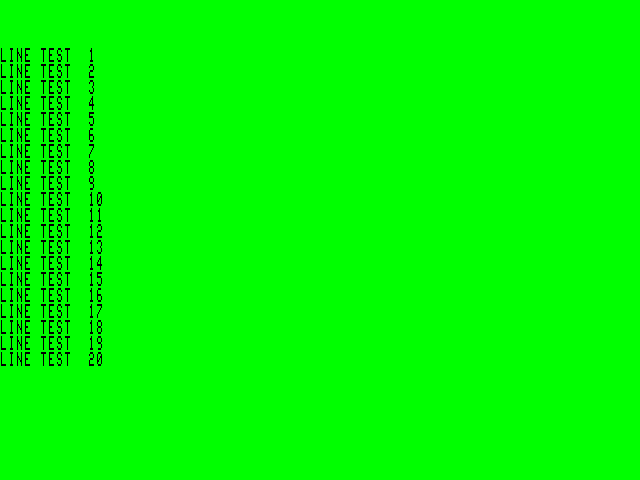
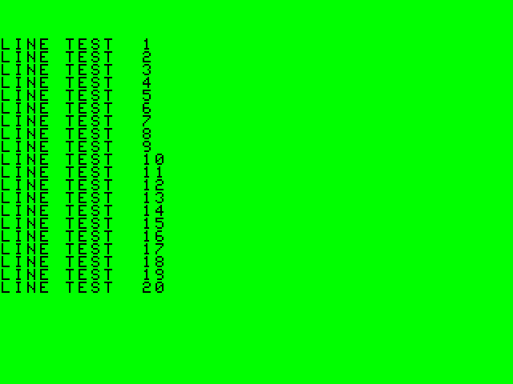

# CoCo BMP Screenshot Generator

I wrote this BMP generator for one of my other projects, but thought others might find it useful and/or interesting to play with themselves.
I wanted a way to capture a screenshot of a CoCo 3 text-mode screen for sharing with people online that would work on <b>real hardware</b> as well as emulators.
And I wanted it to all be done on the CoCo-side of things, so that all you need to do is copy the file off of your disk to the computer of your choice and voila, 
you can share it online!

 

    

<i>BMP Screenshot of WIDTH 80 Screen</i>

    

<i>BMP Screenshot of WIDTH 40 Screen</i>
  

 

At the moment, it only supports 40 and 80 column "Hi-Res" text modes, but in the future i'd like to get the standard 32-column VDG mode working as well.

### Warning

Although I use BASIC's DSKCON routine for safely reading/writing to disk, for simplicity, I am managing the RS-DOS filesystem parts manually and it could <b>absolutely</b> 
be buggy and should be considered unstable until I can do more testing. <b>Do not save screenshots to important disks unless you have them backed up!</b>
And if you do encounter any disk-related bugs, please reach out to me with a report so that I can address them.